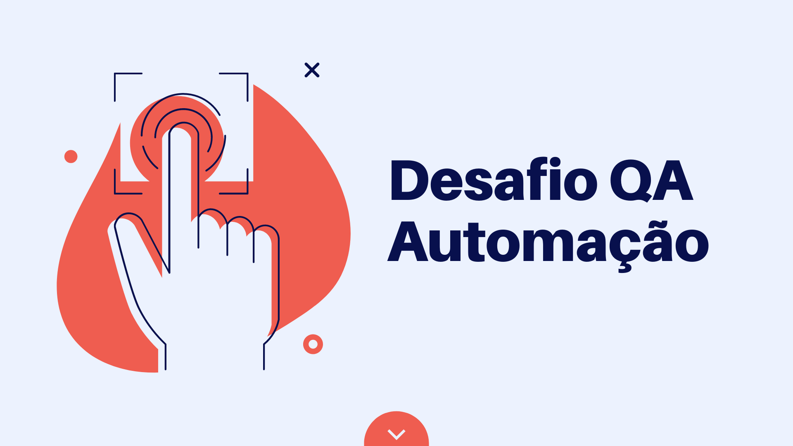
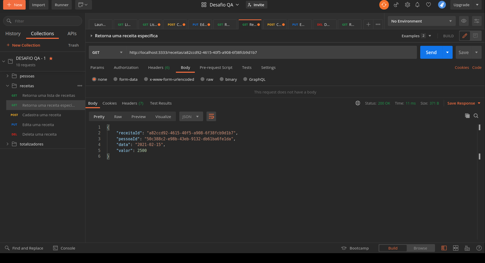
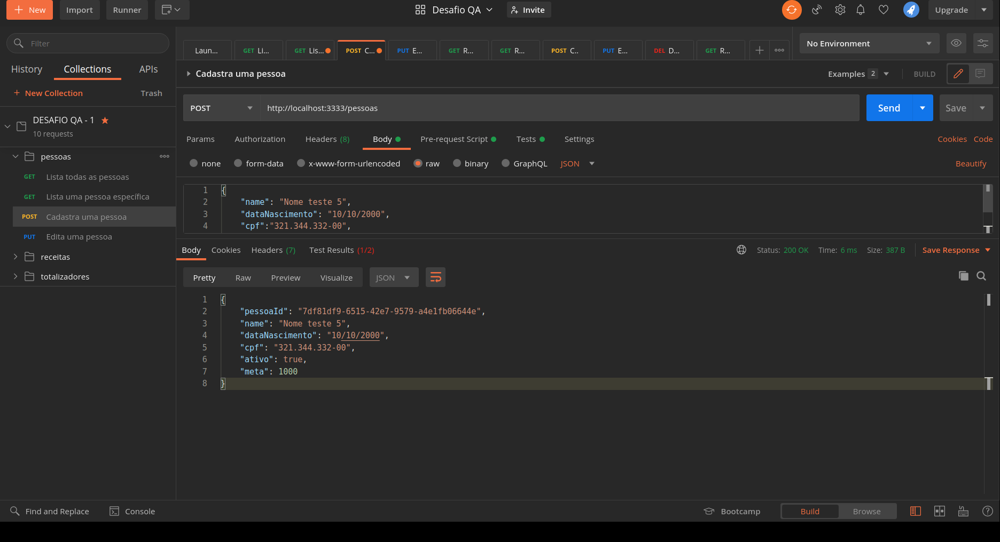
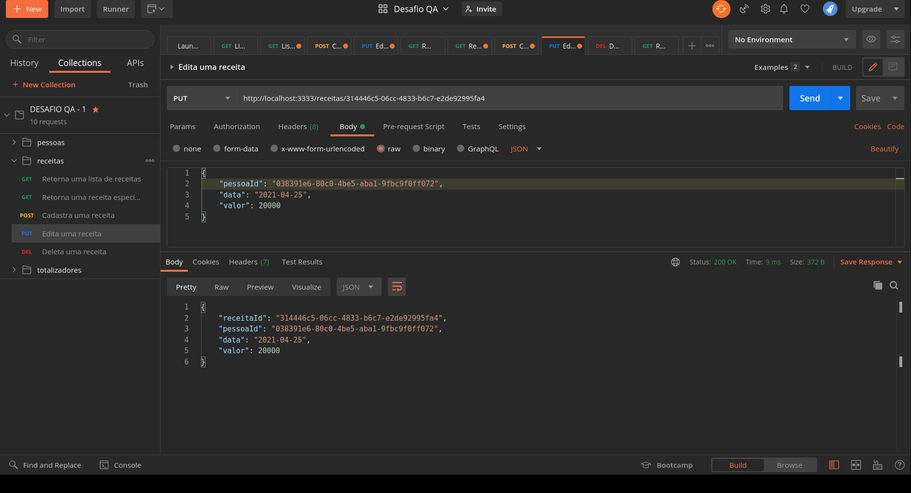
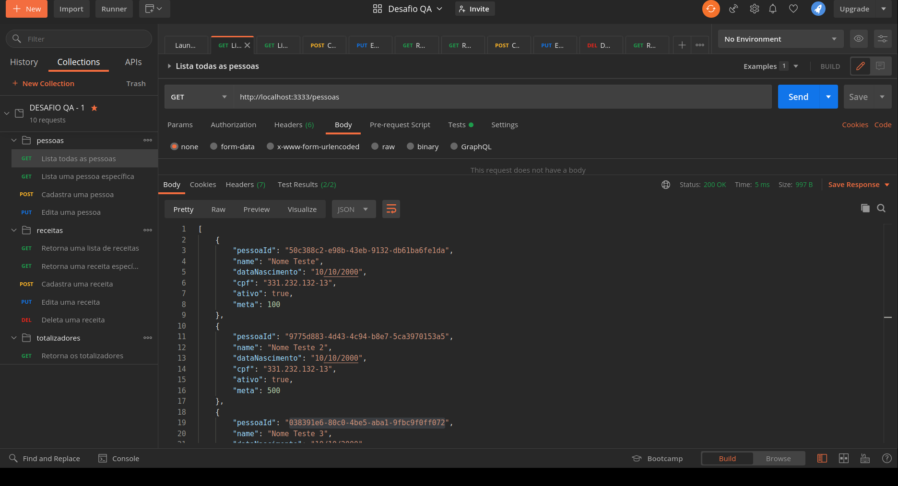
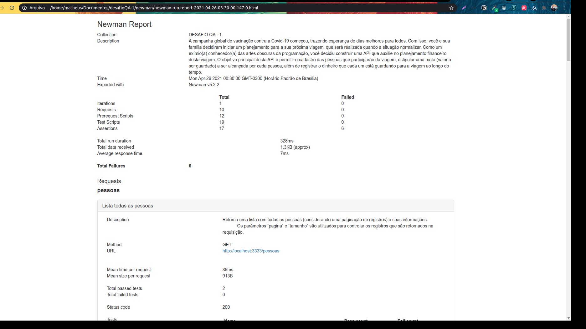
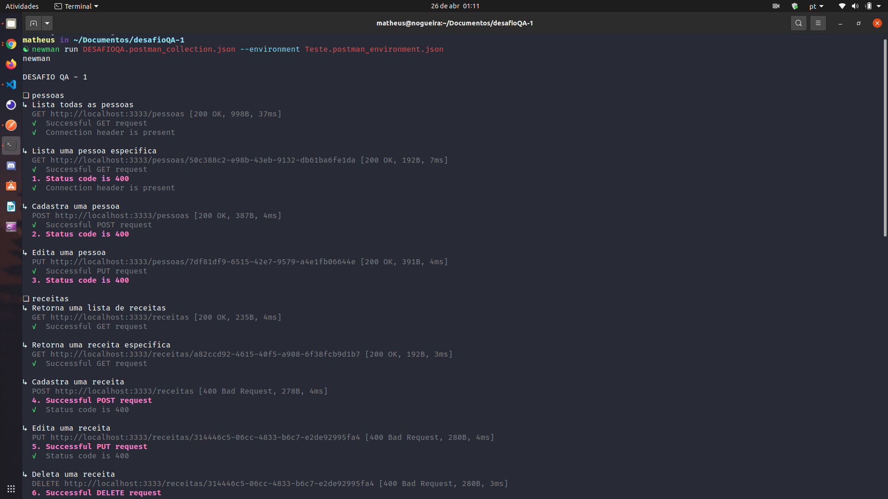

# API Rest
<div align="center">
    
</div>

<div align="center">
    <p>
      Feito por <a href="https://www.linkedin.com/in/matheus-nogueira-6675a751/" target="_blank">Matheus Nogueira🚀</a>.
    </p>
</div>

# :pushpin: Tópicos

* [Sobre o Desafio QA - 1](#dart-sobre-o-desafio-qa)
* [Tecnologias](#computer-tecnologias)
* [Instalação | Rodando](#construction_worker-instalção-e-iniciando)
* [Casos de Teste](#memo-casos-de-teste)
* [Documentação](#books-revisão-da-documentação)

# :dart: Sobre o Desafio QA

Desafio proposto pela empresa [Maxxidata](https://github.com/Maxxidata/qa-challenge)

A campanha global de vacinação contra a Covid-19 começou, trazendo esperança de dias melhores para todos. Com isso, você e sua família decidiram iniciar um planejamento para a sua próxima viagem, que será realizada quando a situação normalizar.

Como um exímio(a) conhecedor(a) das artes obscuras da programação, você decidiu construir uma API que auxilie no planejamento financeiro desta viagem.

O objetivo principal desta API é permitir o cadastro das pessoas que participarão da viagem, estipular uma meta (valor a ser guardado) a ser alcançada por cada pessoa, além de registrar o dinheiro que cada um está guardando para a viagem ao longo do tempo.

Link do desafio:[Postman](https://documenter.getpostman.com/view/14414241/TW77f3WE).

# :computer: Tecnologias
* [Node.Js](https://nodejs.org/en/)
* [Newman](https://www.npmjs.com/package/newman)      
* [Postman](https://www.postman.com/)
* [Express](https://expressjs.com/)
* [Notion](https://www.notion.so/product?utm_source=google&utm_campaign=2075789713&utm_medium=80211061801&utm_content=453572180157&utm_term=notion&targetid=aud-840164194020:kwd-312974742&gclid=Cj0KCQjwppSEBhCGARIsANIs4p5la7Ucsig3zurz1Bg-Y0pT4c5RGU_BKXJodxTyv-Spt_lUIpmgrxIaAr0wEALw_wcB)

# :computer: API com Node.js utilizando Postman com automação Newman.

<div style="display: flex; flex-direction: 'column'; align-items: 'center';">
    
    
    
    
    
     
</div>

# :construction_worker: Instalção e Iniciando
```bash
# Copie esse comando em um terminal
$ git clone https://github.com/Matheus-HFN/desafioQA-1.git

# Entrar na pasta
$ cd desafioQA-1

# Instale as dependências
$ yarn install

# Rodar a aplicação
$ yarn start

#Como instalar o newman
$npm install -g newman 

#Automação de teste API com o newman "No terminal"
$ newman run "sua collection aqui" --environment "sua environment aqui"

#Para visualizar no browser
$ newman run "sua collection aqui" -r html "Vai criar uma pasta 'newman' contendo o arquivo html para visualizar"

# O projeto inciará na porta: 3333
Para visualizar o resultado: http://localhost:3333/(requisição)
```
# :memo: Casos de Teste
Segue o link para os casos de teste. [Casos de Teste](https://www.notion.so/Cria-o-de-casos-de-teste-7f578771bc1c4dc78223d07cd2b7bf63)

# :books: Revisão da documentação
Segue o link para a revisão da documentação. [Revisão](https://www.notion.so/Revis-o-da-documenta-o-55681f1be76146ebad233f5798f0fb34)

## Licença ⚖️
Este projeto está sob a licença do MIT. Veja o arquivo [LICENSE](https://github.com/Matheus-HFN/desafioQA-1/blob/master/LICENSE) para mais detalhes.

[Voltar ao topo](#dart-sobre-o-desafio-qa)